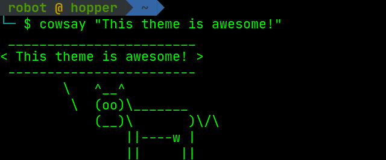

# Agnoster for Bash

This is Agnoster theme for Bash.

Agnoster's Theme - <https://gist.github.com/3712874>
A Powerline-inspired theme for BASH

(Converted from ZSH theme by Kenny Root)
<https://gist.github.com/kruton/8345450>

Updated by Erik Selberg erik@selberg.org 1/14/17
(<https://github.com/speedenator/agnoster-bash>)

Updated by Foad Jafarinejad, May 29, 2020
<https://gitlab.com/foadjn>

## UPDATE

In this version, the $pwd is visible, besides the name of the user and host; also, for the virtual environment a [] will add for better understanding. In the end, `$` moved to the next line for better view and understanding of the command. The rest of the code, is as similar as before.

## README

Install:

For full support, install `fonts-powerline`

```shell
$sudo apt install fonts-powerline
```

To install this theme use the follwing commands

```shell
$cd ~
$mkdir -p .bash/themes/agnoster_bash
$git clone git@gitlab.com:foadjn/agnoster_bash.git .bash/themes/agnoster_bash
```

then add the following to your .bashrc:

```bash
agnoster_path="$HOME/.bash/themes/agnoster_bash/agnoster.bash"
if [[ -f $agnoster_path ]]; then
    source $agnoster_path
fi
```

A screenshot of this theme is shown in the following figure

